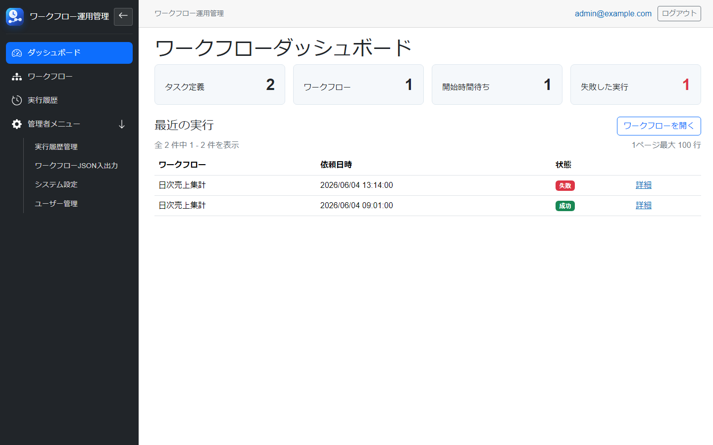
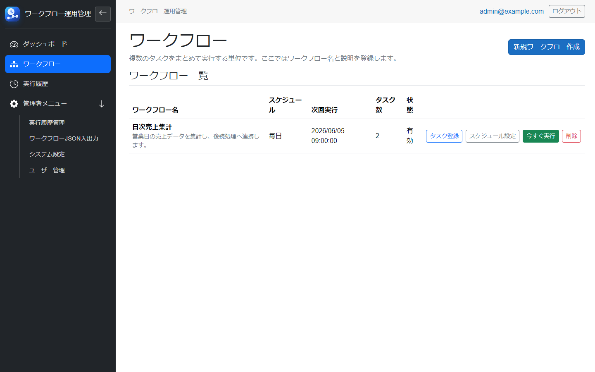
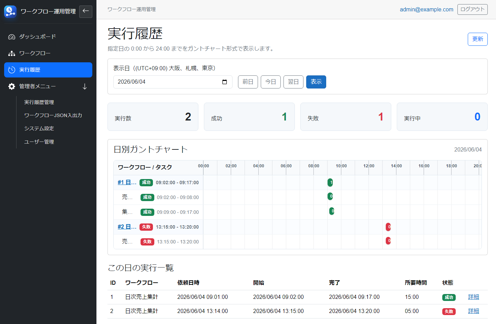
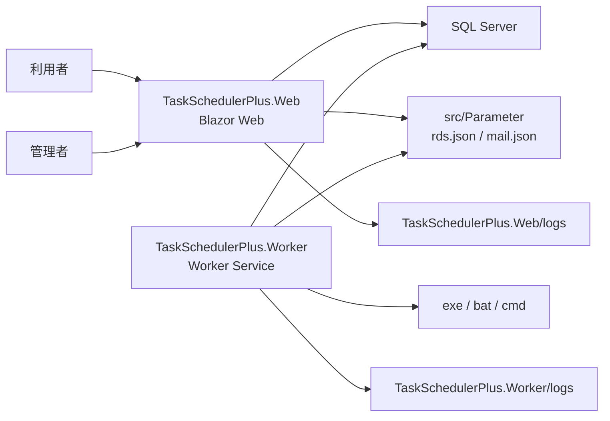
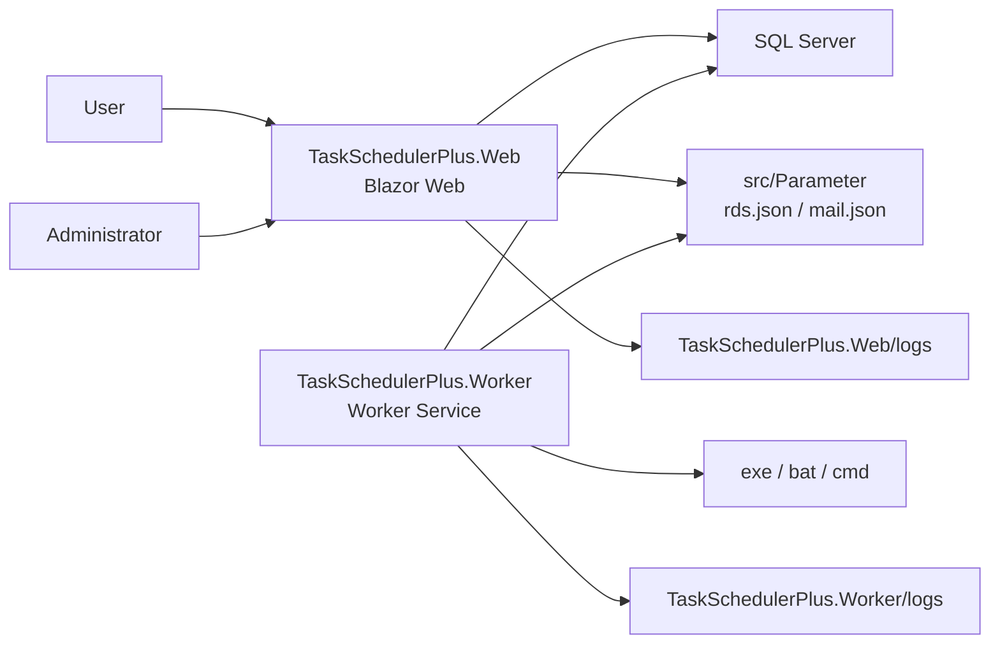

# Task Scheduler Plus

Language: [日本語](#日本語) / [English](#english)

## 日本語

Task Scheduler Plus は、C# / ASP.NET Core / Blazor / SQL Server で構築した、ワークフローとタスクの実行管理システムです。
Web 画面でワークフロー、タスク、スケジュール、実行履歴、ユーザー権限、システム設定を管理し、Worker プロジェクトがスケジュール監視と外部プロセス実行を担当します。

### 主な機能

- ASP.NET Core Identity によるローカルログイン認証
- 管理者、一般ユーザー、参照者のロール管理
- 初回起動時の初期設定画面
- SQL Server 接続先の設定と初期管理者の作成
- ワークフローの作成、変更、削除
- ワークフロー名の重複登録防止
- タスクの登録、変更、削除
- タスク名の重複登録防止
- `.exe`、`.bat`、`.cmd` の実行
- 終了コードによる成功、失敗判定
- 正常終了時に次のタスクへ進むかどうかの制御
- 失敗時に後続処理を止めるかどうかの制御
- タスクスケジューラーのような詳細スケジュール設定
- Worker によるバックグラウンド実行
- 1日単位のガントチャート風の実行履歴
- 管理者による実行履歴削除
- 削除操作前の Bootstrap モーダル確認
- ワークフローとタスク定義の JSON インポート
- ワークフロー単位、検索選択、全件の ZIP エクスポート
- `Parameter` フォルダによる設定ファイル管理
- NLog による Web / Worker のログ出力
- Bootstrap 5 ベースの日本語 UI

### スクリーンショット








### 技術スタック

| 分類 | 使用技術 |
| --- | --- |
| 言語 | C# |
| フレームワーク | ASP.NET Core / Blazor Server |
| ランタイム | .NET 9 |
| データベース | SQL Server / SQL Server LocalDB |
| ORM | Entity Framework Core |
| 認証 | ASP.NET Core Identity |
| ログ | NLog |
| UI | Bootstrap 5 |
| 実行エンジン | .NET Worker Service |

### アーキテクチャ



Web は登録、変更、参照、管理操作を担当します。
Worker はスケジュール監視、実行キュー登録、外部プロセス実行を担当します。
Web と Worker は同じ SQL Server と `src/Parameter` フォルダを共有します。

### プロジェクト構成

```text
.
├─ docs/
│  ├─ DETAILED_DESIGN.md
│  ├─ INSTALLER.md
│  └─ diagrams/
├─ installer/
│  ├─ build-installer.ps1
│  ├─ install.ps1
│  └─ uninstall.ps1
├─ src/
│  ├─ Parameter/                 # 実設定JSON。GitHubには含めません。
│  ├─ TaskSchedulerPlus.sln
│  ├─ TaskSchedulerPlus.slnLaunch
│  ├─ NuGet.Config
│  ├─ TaskSchedulerPlus.Web/
│  └─ TaskSchedulerPlus.Worker/
├─ .gitignore
├─ LICENSE
└─ README.md
```

`docs-private/` は非公開メモ用のローカルディレクトリです。
`DEVELOPMENT_PHILOSOPHY.md` は `docs-private/DEVELOPMENT_PHILOSOPHY.md` で管理し、GitHub には含めません。

### 必要環境

- Windows
- .NET 9 SDK
- SQL Server または SQL Server LocalDB
- Visual Studio 2022 または同等の .NET 開発環境

### セットアップ

依存関係を復元します。

```powershell
dotnet restore .\src\TaskSchedulerPlus.sln
```

Worker を起動します。

```powershell
dotnet run --project .\src\TaskSchedulerPlus.Worker\TaskSchedulerPlus.Worker.csproj
```

Web アプリを起動します。

```powershell
dotnet run --project .\src\TaskSchedulerPlus.Web\TaskSchedulerPlus.Web.csproj
```

Visual Studio でデバッグする場合は、Worker を先に起動し、その後 Web を起動する構成を推奨します。
開発用の主な URL は `http://localhost:5288` または `https://localhost:7255` です。

### 初期設定

初回起動時、設定が存在しない場合、またはログインユーザーが存在しない場合は `/setup` に遷移します。

初期設定では以下を登録します。

- SQL Server 接続先
- 認証方式
- 初期管理者のメールアドレス
- 初期管理者のパスワード
- タイムゾーン

初期設定完了後、必要な DB マイグレーションとロール作成が実行されます。

### DBスキーマ管理方針

このプロジェクトは開発中のため、DBスキーマの後方互換性は保証していません。
GitHub 公開前の途中マイグレーションは保持せず、現在の最終形態を `InitialCreate` として管理します。

開発DBは必要に応じて再作成する前提です。
ワークフローとタスク定義を残したい場合は、DB再作成前に JSON エクスポートし、再作成後に JSON インポートしてください。

正式リリース後に利用者DBの互換性を保証する必要が出た場合は、その時点から追加マイグレーションを積み上げる方針に切り替えます。

### 設定ファイル

設定ファイルは `src/Parameter` フォルダに配置します。
ただし、`rds.json` と `mail.json` は環境依存の実設定を含むため、GitHub には含めません。

```text
src/
  Parameter/
    rds.json      # SQL Server 接続文字列
    mail.json     # SMTP メール送信設定
```

`appsettings.json` には設定値そのものではなく、`Parameter` フォルダへの参照パスを定義します。

開発時:

```json
{
  "Setup": {
    "ParameterPath": "Parameter"
  }
}
```

インストール後:

```json
{
  "Setup": {
    "AppDataPath": "..\\App_Data",
    "ParameterPath": "..\\Parameter"
  }
}
```

### 認証と権限

外部ログインは使用しません。
ASP.NET Core Identity のローカル認証のみを使用します。

| 権限 | できること |
| --- | --- |
| 管理者 | すべての操作、ユーザー管理、設定参照、履歴削除 |
| 一般ユーザー | ワークフローとタスクの登録、変更、実行 |
| 参照者 | 実行結果の閲覧 |

### ログ

ログは NLog で出力します。

```text
src/
  TaskSchedulerPlus.Web/
    logs/
      application.log
      error.log
  TaskSchedulerPlus.Worker/
    logs/
      application.log
      error.log
```

ログは各プログラムの実行直下に出力します。
Web と Worker で出力先を分け、障害調査時に発生元を追跡しやすくしています。
パスワード、接続文字列、SMTPパスワード、メール本文などの機微情報はログに出力しない方針です。

### 主な画面

| パス | 内容 |
| --- | --- |
| `/` | ダッシュボード |
| `/setup` | 初期設定 |
| `/workflows` | ワークフロー一覧、新規作成 |
| `/workflows/{id}` | ワークフロー詳細 |
| `/workflows/{id}/schedule` | スケジュール設定 |
| `/workflows/{id}/tasks` | タスク登録 |
| `/workflows/{id}/tasks/create` | タスク追加 |
| `/runs` | 実行履歴 |
| `/users` | ユーザー管理 |
| `/users/create` | ユーザー追加 |
| `/parameters` | システム設定参照 |
| `/admin/run-history` | 実行履歴管理 |
| `/admin/workflow-json` | ワークフローJSON入出力メニュー |
| `/admin/workflow-json/export` | ワークフローJSONエクスポート |
| `/admin/workflow-json/import` | ワークフローJSONインポート |

### インストーラー

Windows Service として Web / Worker を登録するためのインストーラー作成スクリプトがあります。

```powershell
powershell -ExecutionPolicy Bypass -File .\installer\build-installer.ps1
```

生成物は `artifacts/installer/` に出力されます。
`artifacts/` は GitHub には含めません。

詳細は [docs/INSTALLER.md](docs/INSTALLER.md) を参照してください。

### 開発

ソリューションをビルドします。

```powershell
dotnet build .\src\TaskSchedulerPlus.sln
```

Web のみビルドします。

```powershell
dotnet build .\src\TaskSchedulerPlus.Web\TaskSchedulerPlus.Web.csproj
```

Worker のみビルドします。

```powershell
dotnet build .\src\TaskSchedulerPlus.Worker\TaskSchedulerPlus.Worker.csproj
```

### GitHubへ公開しないもの

以下は `.gitignore` で除外します。

- `src/Parameter/*.json`
- `/Parameter/`
- `src/**/App_Data/`
- `src/**/logs/`
- `artifacts/`
- `tmp/`
- `docs-private/`
- `.dotnet/`
- `.nuget/`
- `.tools/`
- `bin/`
- `obj/`
- `.vs/`
- `*.suo`
- `*.user`
- `*.log`

特に `src/Parameter/rds.json` と `src/Parameter/mail.json` は接続文字列やメール設定を含むため、コミットしないでください。

### セキュリティ

- パスワードは ASP.NET Core Identity で管理します。
- DB 接続文字列は初期設定ファイル内で保護します。
- 実設定JSONは GitHub に含めない方針です。
- メールパスワードなどの機微情報はログに出力しない方針です。

### ライセンス

このプロジェクトは MIT License です。
詳細は [LICENSE](LICENSE) を参照してください。

---

## English

Task Scheduler Plus is a workflow and task execution management system built with C#, ASP.NET Core, Blazor, and SQL Server.
The Web project manages workflows, tasks, schedules, execution history, user roles, and system settings.
The Worker project monitors schedules and executes external processes in the background.

### Features

- Local authentication with ASP.NET Core Identity
- Role management for administrators, general users, and viewers
- Initial setup screen on first launch
- SQL Server connection setup and initial administrator creation
- Workflow creation, editing, and deletion
- Duplicate workflow name prevention
- Task creation, editing, and deletion
- Duplicate task name prevention
- Execution of `.exe`, `.bat`, and `.cmd` files
- Success and failure judgment by exit code
- Control whether the next task runs after success
- Control whether later tasks stop after failure
- Detailed schedule settings
- Background execution by Worker
- Daily Gantt-style execution history
- Execution history cleanup by administrators
- Bootstrap modal confirmation before delete operations
- Workflow and task JSON import
- Per-workflow, searched selection, and full ZIP export
- Configuration files under the `Parameter` folder
- Logging with NLog for Web and Worker projects
- Japanese UI based on Bootstrap 5

### Screenshots


### Tech Stack

| Category | Technology |
| --- | --- |
| Language | C# |
| Framework | ASP.NET Core / Blazor Server |
| Runtime | .NET 9 |
| Database | SQL Server / SQL Server LocalDB |
| ORM | Entity Framework Core |
| Authentication | ASP.NET Core Identity |
| Logging | NLog |
| UI | Bootstrap 5 |
| Execution Engine | .NET Worker Service |

### Architecture



The Web project handles registration, editing, viewing, and administrative operations.
The Worker project handles schedule monitoring, queue registration, and external process execution.
Both projects share the same SQL Server database and `src/Parameter` folder.

### Project Structure

```text
.
├─ docs/
│  ├─ DETAILED_DESIGN.md
│  ├─ INSTALLER.md
│  └─ diagrams/
├─ installer/
│  ├─ build-installer.ps1
│  ├─ install.ps1
│  └─ uninstall.ps1
├─ src/
│  ├─ Parameter/                 # Runtime setting JSON files. Not committed.
│  ├─ TaskSchedulerPlus.sln
│  ├─ TaskSchedulerPlus.slnLaunch
│  ├─ NuGet.Config
│  ├─ TaskSchedulerPlus.Web/
│  └─ TaskSchedulerPlus.Worker/
├─ .gitignore
├─ LICENSE
└─ README.md
```

`docs-private/` is a local-only directory for private notes.
`DEVELOPMENT_PHILOSOPHY.md` is managed as `docs-private/DEVELOPMENT_PHILOSOPHY.md` and is not included in GitHub.

### Requirements

- Windows
- .NET 9 SDK
- SQL Server or SQL Server LocalDB
- Visual Studio 2022 or an equivalent .NET development environment

### Setup

Restore dependencies.

```powershell
dotnet restore .\src\TaskSchedulerPlus.sln
```

Run the Worker.

```powershell
dotnet run --project .\src\TaskSchedulerPlus.Worker\TaskSchedulerPlus.Worker.csproj
```

Run the Web application.

```powershell
dotnet run --project .\src\TaskSchedulerPlus.Web\TaskSchedulerPlus.Web.csproj
```

When debugging with Visual Studio, it is recommended to start the Worker first and then start the Web project.
Typical development URLs are `http://localhost:5288` and `https://localhost:7255`.

### Initial Setup

On first launch, the application redirects to `/setup` if it is not configured or if no login user exists.

The setup screen registers:

- SQL Server connection
- Authentication mode
- Initial administrator email address
- Initial administrator password
- Time zone

After setup, database migrations and required role creation are executed.

### Database Schema Policy

This project is still under active development, so database schema backward compatibility is not guaranteed.
Pre-publication intermediate migrations are not kept; the current final schema is managed as `InitialCreate`.

Development databases are expected to be recreated when needed.
If you want to keep workflow and task definitions, export them as JSON before recreating the database and import them again afterward.

After a formal release, the project can switch to accumulating additional migrations when user database compatibility becomes necessary.

### Configuration

Configuration files are stored under the `src/Parameter` folder.
However, `rds.json` and `mail.json` contain environment-specific settings and are not committed to GitHub.

```text
src/
  Parameter/
    rds.json      # SQL Server connection string
    mail.json     # SMTP email settings
```

`appsettings.json` stores the path to the `Parameter` folder, not the actual configuration values.

Development:

```json
{
  "Setup": {
    "ParameterPath": "Parameter"
  }
}
```

Installed environment:

```json
{
  "Setup": {
    "AppDataPath": "..\\App_Data",
    "ParameterPath": "..\\Parameter"
  }
}
```

### Authentication and Authorization

External login providers are not used.
The application uses only local authentication with ASP.NET Core Identity.

| Role | Permissions |
| --- | --- |
| Administrator | All operations, user management, settings view, history cleanup |
| General User | Create, edit, and execute workflows and tasks |
| Viewer | View execution results |

### Logging

Logs are written by NLog.

```text
src/
  TaskSchedulerPlus.Web/
    logs/
      application.log
      error.log
  TaskSchedulerPlus.Worker/
    logs/
      application.log
      error.log
```

Logs are written under each program's execution root.
Web and Worker logs are separated to make troubleshooting easier.
Sensitive values such as passwords, connection strings, SMTP passwords, and email bodies are not written to logs.

### Main Pages

| Path | Description |
| --- | --- |
| `/` | Dashboard |
| `/setup` | Initial setup |
| `/workflows` | Workflow list and creation |
| `/workflows/{id}` | Workflow details |
| `/workflows/{id}/schedule` | Schedule settings |
| `/workflows/{id}/tasks` | Task registration |
| `/workflows/{id}/tasks/create` | Task creation |
| `/runs` | Execution history |
| `/users` | User management |
| `/users/create` | User creation |
| `/parameters` | System settings viewer |
| `/admin/run-history` | Execution history management |
| `/admin/workflow-json` | Workflow JSON import/export menu |
| `/admin/workflow-json/export` | Workflow JSON export |
| `/admin/workflow-json/import` | Workflow JSON import |

### Installer

An installer build script is available for registering Web and Worker as Windows Services.

```powershell
powershell -ExecutionPolicy Bypass -File .\installer\build-installer.ps1
```

Generated packages are written under `artifacts/installer/`.
The `artifacts/` folder is not committed to GitHub.

See [docs/INSTALLER.md](docs/INSTALLER.md) for details.

### Development

Build the solution.

```powershell
dotnet build .\src\TaskSchedulerPlus.sln
```

Build only the Web project.

```powershell
dotnet build .\src\TaskSchedulerPlus.Web\TaskSchedulerPlus.Web.csproj
```

Build only the Worker project.

```powershell
dotnet build .\src\TaskSchedulerPlus.Worker\TaskSchedulerPlus.Worker.csproj
```

### Not Committed To GitHub

The following files and directories are ignored:

- `src/Parameter/*.json`
- `/Parameter/`
- `src/**/App_Data/`
- `src/**/logs/`
- `artifacts/`
- `tmp/`
- `docs-private/`
- `.dotnet/`
- `.nuget/`
- `.tools/`
- `bin/`
- `obj/`
- `.vs/`
- `*.suo`
- `*.user`
- `*.log`

Do not commit `src/Parameter/rds.json` or `src/Parameter/mail.json` because they may contain connection strings and email settings.

### Security

- Passwords are managed by ASP.NET Core Identity.
- The database connection string is protected in the setup configuration.
- Runtime setting JSON files are not committed to GitHub.
- Sensitive values such as email passwords should not be written to logs.

### License

This project is licensed under the MIT License.
See [LICENSE](LICENSE) for details.
