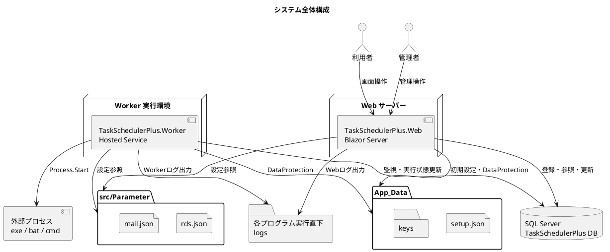
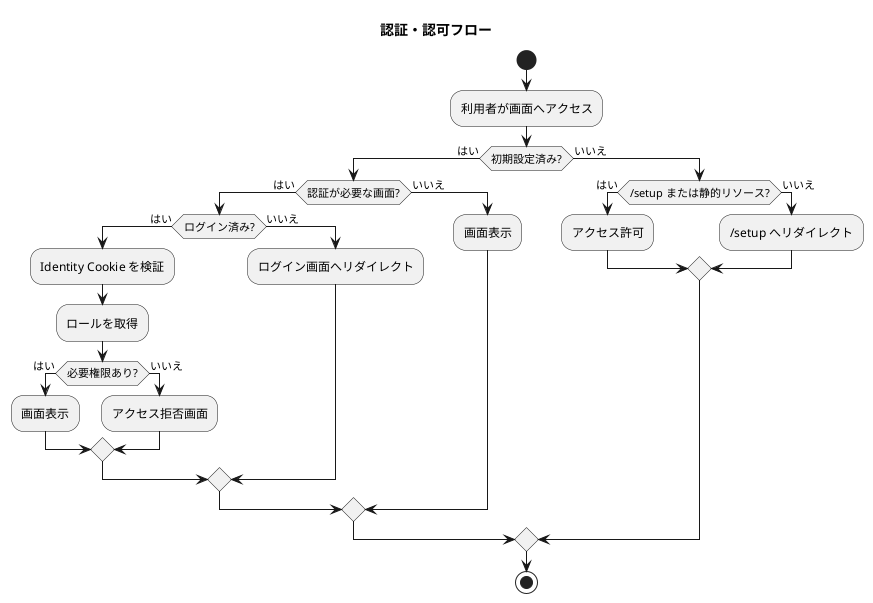
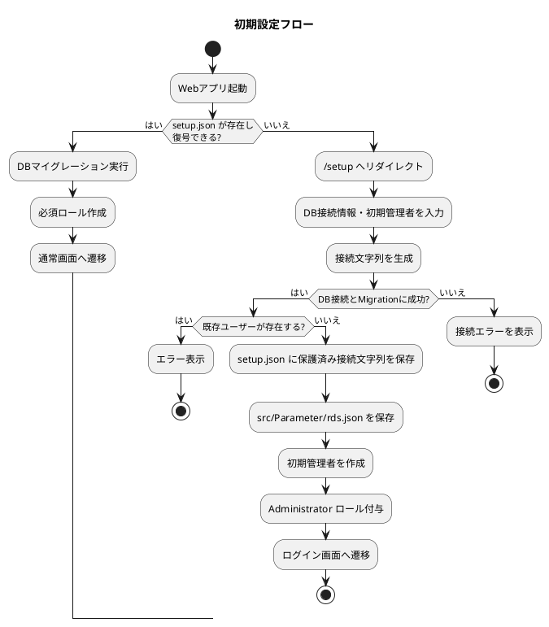
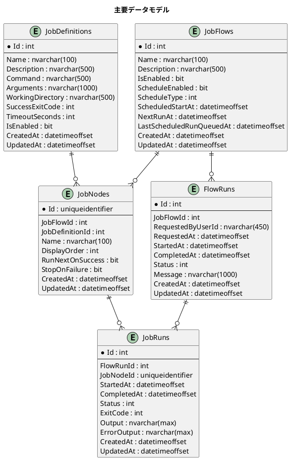
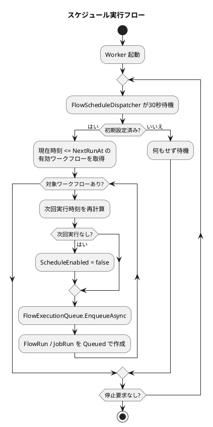
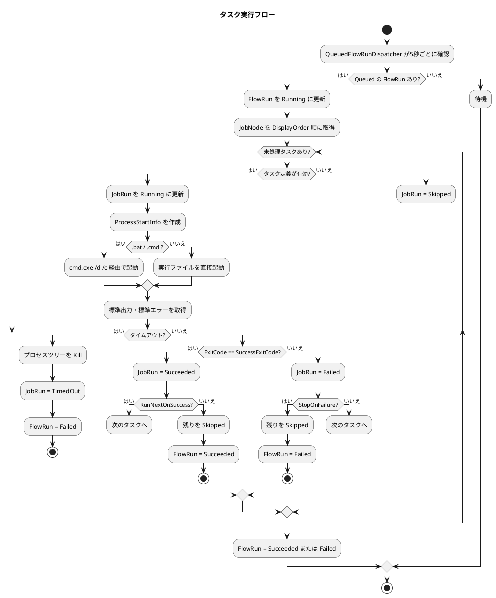
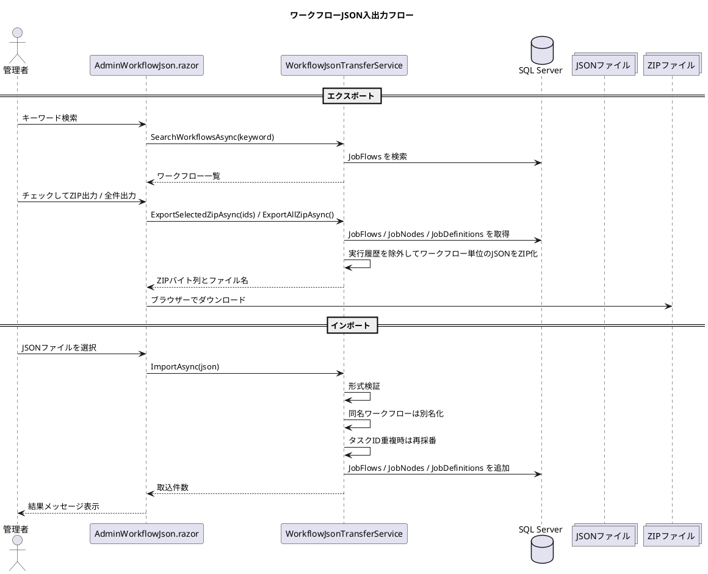

# 詳細設計書

## 1. 文書概要

本書は、Task Scheduler Plus の現行実装を対象とした詳細設計書である。
Web 画面、Worker、サービス層、データモデル、設定ファイル、認証・認可、実行フローを整理し、保守・拡張時に参照できる状態にする。

### 1.1 対象範囲

- `src/TaskSchedulerPlus.Web`
- `src/TaskSchedulerPlus.Worker`
- `src/Parameter`
- `docs/diagrams`

### 1.2 対象外

- Bootstrap 配布ファイルの内部設計
- ASP.NET Core Identity 標準テーブルの詳細定義
- SQL Server 自体の物理設計
- OS、IIS、Windows Service の詳細なインフラ構成

## 2. システム概要

Task Scheduler Plus は、ワークフロー単位でタスクを登録し、手動またはスケジュールにより実行するシステムである。

Web プロジェクトは画面操作、認証、設定参照、ユーザー管理を担当する。
Worker プロジェクトはスケジュール監視、実行キュー投入、タスク実行を担当する。

### 2.1 全体構成図

PlantUML:

```text
docs/diagrams/system-architecture.puml
```



## 3. 技術構成

| 分類 | 内容 |
| --- | --- |
| 言語 | C# |
| ランタイム | .NET 9 |
| Web | ASP.NET Core / Blazor Server |
| Worker | .NET Worker Service |
| DB | SQL Server / LocalDB |
| ORM | Entity Framework Core |
| 認証 | ASP.NET Core Identity |
| ログ | NLog |
| UI | Bootstrap 5 |

## 4. プロジェクト構成

```text
src/
  TaskSchedulerPlus.sln
  TaskSchedulerPlus.slnLaunch
  NuGet.Config
  Parameter/
    rds.json
    mail.json
  TaskSchedulerPlus.Web/
    Components/
    Data/
    Services/
    Program.cs
  TaskSchedulerPlus.Worker/
    Program.cs
docs/
  DEVELOPMENT_PHILOSOPHY.md
  DETAILED_DESIGN.md
  diagrams/
```

### 4.1 TaskSchedulerPlus.Web

Blazor Server による Web UI を提供する。
主な責務は次の通り。

- ログイン、ログアウト
- 初期設定
- ダッシュボード表示
- ワークフロー管理
- スケジュール設定
- タスク管理
- 実行履歴表示
- ユーザー管理
- パラメーター参照
- 管理者向け履歴削除

### 4.2 TaskSchedulerPlus.Worker

常駐処理を担当する Worker プロジェクトである。
主な責務は次の通り。

- スケジュール監視
- 実行キュー登録
- キュー済みワークフローの実行
- タスクの外部プロセス起動
- 実行状態の DB 更新

## 5. 設定設計

### 5.1 appsettings.json

`appsettings.json` には設定値そのものではなく、設定ファイルの参照先を定義する。

Web:

```json
{
  "Setup": {
    "ParameterPath": "Parameter"
  }
}
```

Worker:

```json
{
  "Setup": {
    "AppDataPath": "..\\TaskSchedulerPlus.Web\\App_Data",
    "ParameterPath": "Parameter"
  }
}
```

### 5.2 Parameter フォルダ

`Parameter` は `src/Parameter` に配置する。
`src` は開発用ソース一式のルートであり、`.sln` と共有設定を同じ階層で管理する。
Web と Worker は同じ `src/Parameter` フォルダを参照する。

| ファイル | 内容 |
| --- | --- |
| `rds.json` | SQL Server 接続文字列 |
| `mail.json` | SMTP メール送信設定 |

`rds.json` は `Provider` と `ConnectionString` のみを持つ。
接続文字列から取得できる派生項目は保存しない。

### 5.3 App_Data

`App_Data` は Web プロジェクト配下に配置する。

| パス | 内容 |
| --- | --- |
| `App_Data/setup.json` | 初期設定情報、保護済み接続文字列 |
| `App_Data/keys` | Data Protection キー |

Worker は `Setup:AppDataPath` により Web 側の `App_Data` を参照する。

## 6. 起動設計

### 6.1 Web 起動

`src/TaskSchedulerPlus.Web/Program.cs` で以下を登録する。

- NLog
- Razor Components
- Identity 認証
- 認可ポリシー
- Data Protection
- ParameterFileStore
- ISetupConfigurationStore
- DbContextFactory
- InitialSetupService
- IdentityCore
- ParameterEmailSender
- FlowExecutionQueue

初期設定済みの場合のみ、DB マイグレーションとロール作成を行う。
未設定の場合は `/setup` と静的リソース以外を `/setup` へリダイレクトする。

### 6.2 Worker 起動

`src/TaskSchedulerPlus.Worker/Program.cs` で以下を登録する。

- NLog
- Data Protection
- Windows Service 名
- ParameterFileStore
- ISetupConfigurationStore
- DbContextFactory
- FlowExecutionQueue
- FlowScheduleDispatcher
- QueuedFlowRunDispatcher

初期設定済みの場合のみ、DB マイグレーションを行う。

## 7. 認証・認可設計

### 7.1 認証

ASP.NET Core Identity のローカル認証のみを使用する。
外部ログインは使用しない。

### 7.2 ロール

| ロール | 表示名 | 概要 |
| --- | --- | --- |
| `Administrator` | 管理者 | すべての操作が可能 |
| `GeneralUser` | 一般ユーザー | ワークフロー・タスクの登録、変更、実行が可能 |
| `Viewer` | 参照者 | 実行結果の参照のみ可能 |

### 7.3 認可ポリシー

| ポリシー | 対象ロール | 用途 |
| --- | --- | --- |
| `ManageUsers` | Administrator | ユーザー管理、設定参照 |
| `ManageWorkflows` | Administrator, GeneralUser | ワークフロー、タスク、スケジュール管理 |
| `ViewExecutionResults` | Administrator, GeneralUser, Viewer | ダッシュボード、実行履歴参照 |

### 7.4 認証・認可フロー

PlantUML:

```text
docs/diagrams/auth-authorization-flow.puml
```



## 8. 初期設定設計

### 8.1 画面

| 項目 | 内容 |
| --- | --- |
| ルート | `/setup` |
| コンポーネント | `Setup.razor` |
| サービス | `InitialSetupService` |
| 認可 | AllowAnonymous |

### 8.2 入力項目

- システム名
- SQL Server サーバー名
- データベース名
- 認証方式
- DB ユーザー名
- DB パスワード
- 暗号化接続
- サーバー証明書信頼
- タイムゾーン
- 初期管理者メールアドレス
- 初期管理者パスワード
- 初期管理者パスワード確認

### 8.3 処理内容

1. 初期設定済みか確認する。
2. 入力値から接続文字列を生成する。
3. DB へ接続する。
4. EF Core Migration を適用する。
5. 既存ユーザーが存在しないことを確認する。
6. `setup.json` を保存する。
7. `rds.json` を保存する。
8. 必須ロールを作成する。
9. 初期管理者を作成する。
10. 初期管理者へ `Administrator` ロールを付与する。

### 8.4 初期設定フロー

PlantUML:

```text
docs/diagrams/initial-setup-flow.puml
```



## 9. 画面設計

### 9.1 画面一覧

| 画面 | ルート | コンポーネント | 認可 |
| --- | --- | --- | --- |
| ダッシュボード | `/` | `Home.razor` | ViewExecutionResults |
| 初期設定 | `/setup` | `Setup.razor` | AllowAnonymous |
| ワークフロー一覧 | `/workflows`, `/flows` | `Flows.razor` | ManageWorkflows |
| スケジュール設定 | `/workflows/{WorkflowId:int}/schedule` | `WorkflowSchedule.razor` | ManageWorkflows |
| タスク登録 | `/workflows/{WorkflowId:int}/tasks` | `WorkflowTasks.razor` | ManageWorkflows |
| タスク追加 | `/workflows/{WorkflowId:int}/tasks/create` | `WorkflowTaskCreate.razor` | ManageWorkflows |
| 実行履歴 | `/runs`, `/runs/{RunId:int}` | `Runs.razor` | ViewExecutionResults |
| ユーザー管理 | `/users` | `Users.razor` | ManageUsers |
| ユーザー追加 | `/users/create` | `UserCreate.razor` | ManageUsers |
| パラメーター参照 | `/parameters` | `Parameters.razor` | ManageUsers |
| 実行履歴管理 | `/admin/run-history` | `AdminRunHistory.razor` | Administrator |
| ワークフローJSON入出力 | `/admin/workflow-json` | `AdminWorkflowJson.razor` | Administrator |
| ワークフローJSONエクスポート | `/admin/workflow-json/export` | `AdminWorkflowJsonExport.razor` | Administrator |
| ワークフローJSONインポート | `/admin/workflow-json/import` | `AdminWorkflowJsonImport.razor` | Administrator |
| ログイン | `/Account/Login` | `Login.razor` | 匿名 |
| パスワード再設定 | `/Account/ForgotPassword` | `ForgotPassword.razor` | 匿名 |

### 9.2 レイアウト

`MainLayout.razor` が全体レイアウトを担当する。

- 左サイドバー
- 右上ログインユーザー表示
- アカウント操作
- 本文領域
- Blazor エラー表示

`NavMenu.razor` はログイン状態と権限によりメニューを出し分ける。

### 9.3 UI 方針

- Bootstrap 5 を基本にする。
- 文言は日本語を基本にする。
- ログイン画面は Bootstrap サンプルに近い中央配置とする。
- 管理者メニューはサイドバー内でドロップダウンにまとめる。
- サイドバーは開閉可能にする。
- サイドバーを閉じた状態ではヘッダーの開くボタンは表示せず、ブランド部分をクリックして開く。
- 設定参照画面は card を多用せず、システム設定画面のような構成にする。
- 削除操作は必ず `DeleteConfirmationModal.razor` の Bootstrap モーダルで「削除しますか」と確認してから実行する。

## 10. データ設計

### 10.1 主要テーブル

PlantUML:

```text
docs/diagrams/data-model.puml
```



### 10.2 JobFlows

ワークフローの基本情報とスケジュール設定を保持する。

主な項目:

- `Id`
- `Name`
- `Description`
- `IsEnabled`
- `ScheduleEnabled`
- `ScheduleType`
- `ScheduledStartAt`
- `ScheduleIntervalMinutes`
- `ScheduleEveryDays`
- `ScheduleEveryWeeks`
- `ScheduleDayOfMonth`
- `ScheduleEveryMonths`
- `ScheduleDaysOfWeek`
- `ScheduleEndAt`
- `RepeatEnabled`
- `RepeatIntervalMinutes`
- `RepeatDurationMinutes`
- `NextRunAt`
- `LastScheduledRunQueuedAt`
- `CreatedAt`
- `UpdatedAt`

制約:

- `Name` は一意。
- `ScheduleEnabled` と `NextRunAt` にインデックスを持つ。

### 10.3 JobDefinitions

実行対象となるタスク定義を保持する。

主な項目:

- `Id`
- `Name`
- `Description`
- `Command`
- `Arguments`
- `WorkingDirectory`
- `SuccessExitCode`
- `TimeoutSeconds`
- `IsEnabled`
- `CreatedAt`
- `UpdatedAt`

### 10.4 JobNodes

ワークフロー内に配置されたタスクを表す。
主キーは `Guid` とする。

主な項目:

- `Id`
- `JobFlowId`
- `JobDefinitionId`
- `Name`
- `RunNextOnSuccess`
- `StopOnFailure`
- `DisplayOrder`
- `CreatedAt`
- `UpdatedAt`

制約:

- `JobFlowId` と `Name` の組み合わせは一意。
- `JobFlow` 削除時は cascade。
- `JobDefinition` 削除時は restrict。

### 10.5 FlowRuns

ワークフロー1回分の実行履歴を保持する。

主な項目:

- `Id`
- `JobFlowId`
- `RequestedByUserId`
- `RequestedAt`
- `StartedAt`
- `CompletedAt`
- `Status`
- `Message`
- `CreatedAt`
- `UpdatedAt`

### 10.6 JobRuns

ワークフロー実行内の個別タスク実行履歴を保持する。

主な項目:

- `Id`
- `FlowRunId`
- `JobNodeId`
- `StartedAt`
- `CompletedAt`
- `Status`
- `ExitCode`
- `Output`
- `ErrorOutput`
- `CreatedAt`
- `UpdatedAt`

制約:

- `FlowRunId` と `JobNodeId` の組み合わせは一意。

### 10.7 監査項目

以下のテーブルは `CreatedAt` と `UpdatedAt` を持つ。

- `JobDefinitions`
- `JobFlows`
- `JobNodes`
- `FlowRuns`
- `JobRuns`

`ApplicationDbContext.SaveChanges` / `SaveChangesAsync` で自動更新する。
DB 側にも `SYSUTCDATETIME()` の既定値を持つ。

### 10.8 DBスキーマ管理方針

開発中は DB スキーマの後方互換性を保証しない。
公開前の途中マイグレーションは保持せず、現在の最終形態を `InitialCreate` として管理する。

開発DBは必要に応じて再作成する前提とする。
ワークフローとタスク定義を保持したい場合は、DB再作成前に JSON エクスポートを行い、再作成後に JSON インポートで復元する。

正式リリース後、利用者DBの互換性を保証する必要が出た場合は、その時点から追加マイグレーションを積み上げる。

## 11. サービス設計

### 11.1 InitialSetupService

初期設定を完了するサービス。

主な責務:

- 接続文字列生成
- DB 接続確認
- Migration 実行
- 初期ユーザー重複確認
- 初期設定保存
- 初期管理者作成
- ロール付与

### 11.2 FileSetupConfigurationStore

`App_Data/setup.json` に初期設定を保存する。

主な責務:

- 初期設定の読み込み
- 初期設定の保存
- 初期設定の削除
- 接続文字列の保護と復号
- `src/Parameter/rds.json` への同期

### 11.3 ParameterFileStore

`Parameter` フォルダの JSON ファイルを扱う。

主な責務:

- `rds.json` 読み込み、保存、削除
- `mail.json` 読み込み
- `mail.json` が存在しない場合の既定ファイル作成
- 管理画面用の JSON スナップショット取得

### 11.4 ParameterEmailSender

Identity のメール送信処理を担当する。

主な責務:

- メール確認リンク送信
- パスワード再設定リンク送信
- パスワード再設定コード送信
- `mail.json` 未設定時の送信スキップ

### 11.5 WorkflowJsonTransferService

管理者向けのワークフローJSON入出力を担当する。

主な責務:

- ワークフロー、スケジュール、タスク定義のJSONエクスポート
- 検索、選択、全件指定によるワークフロー単位のZIPエクスポート
- JSONファイルの形式検証
- ワークフロー名重複時の別名登録
- タスクID重複時の再採番
- インポート時の次回実行日時再計算

実行履歴は環境ごとの運用結果であるため、エクスポートおよびインポート対象外とする。

### 11.6 FlowExecutionQueue

ワークフロー実行要求を DB にキュー登録する。

主な責務:

- 対象ワークフロー取得
- `FlowRun` 作成
- `JobRun` 作成
- 作成した `FlowRun.Id` を返す

### 11.7 FlowScheduleDispatcher

スケジュール時刻を過ぎたワークフローを検出する常駐サービス。

主な責務:

- 30秒間隔で DB を確認
- `NextRunAt <= 現在時刻` のワークフローを取得
- 次回実行日時を再計算
- 実行キューへ登録
- 登録失敗時にスケジュール状態を戻す

### 11.8 QueuedFlowRunDispatcher

キュー済みの実行履歴を取り出し、タスクを実行する常駐サービス。

主な責務:

- 5秒間隔で Queued の `FlowRun` を確認
- `FlowRun` を Running に更新
- `JobNode.DisplayOrder` 順にタスクを実行
- `Process.Start` で外部プロセス起動
- 標準出力、標準エラー、終了コードを保存
- タイムアウト時にプロセスツリーを終了
- 後続タスクの実行可否を制御

### 11.9 ScheduleCalculator

スケジュール設定から次回実行日時を計算する。

対応するスケジュール種別:

- 一回のみ
- 毎日
- 毎週
- 毎月
- 一定間隔
- 指定時間内の繰り返し
- 有効期限

### 11.10 NLogSetup

Web と Worker 共通の NLog 設定をコードで構築する。

出力:

- `src/TaskSchedulerPlus.Web/logs/application.log`
- `src/TaskSchedulerPlus.Web/logs/error.log`
- `src/TaskSchedulerPlus.Worker/logs/application.log`
- `src/TaskSchedulerPlus.Worker/logs/error.log`

## 12. スケジュール実行設計

### 12.1 スケジュール登録

`WorkflowSchedule.razor` でワークフローのスケジュール条件を登録する。
保存時に `ScheduleCalculator.CalculateNextRun` を呼び出し、次回実行日時を `JobFlows.NextRunAt` へ保存する。

### 12.2 スケジュール監視

Worker の `FlowScheduleDispatcher` が30秒ごとに DB を確認する。
対象条件は次の通り。

- `IsEnabled = true`
- `ScheduleEnabled = true`
- `NextRunAt is not null`
- `NextRunAt <= DateTimeOffset.UtcNow`

### 12.3 スケジュール実行フロー

PlantUML:

```text
docs/diagrams/scheduled-execution-flow.puml
```



## 13. タスク実行設計

### 13.1 実行方式

外部プロセス実行は `System.Diagnostics.Process.Start` を使用する。

`.bat` と `.cmd` は直接実行せず、`cmd.exe /d /c` 経由で実行する。
それ以外は解決済みパスを直接起動する。

`UseShellExecute = false` とし、標準出力と標準エラーを取得する。

### 13.2 実行結果判定

| 条件 | 状態 |
| --- | --- |
| `ExitCode == SuccessExitCode` | Succeeded |
| `ExitCode != SuccessExitCode` | Failed |
| タイムアウト | TimedOut |
| タスク定義無効 | Skipped |
| 後続停止 | Skipped |

### 13.3 後続制御

`JobNode.RunNextOnSuccess`:

- `true`: 正常終了時に次のタスクへ進む。
- `false`: 正常終了後、残りのタスクを `Skipped` にする。

`JobNode.StopOnFailure`:

- `true`: 失敗時に残りのタスクを `Skipped` にする。
- `false`: 失敗しても次のタスクへ進む。

### 13.4 タスク実行フロー

PlantUML:

```text
docs/diagrams/task-execution-flow.puml
```



## 14. 実行履歴設計

### 14.1 履歴表示

`Runs.razor` で実行履歴を表示する。

主な表示:

- 対象日
- 実行件数
- 成功件数
- 失敗件数
- 実行中件数
- 1日ガントチャート
- 実行一覧
- 個別実行詳細

### 14.2 ガントチャート

対象日の 0:00 から 24:00 を横軸にし、`FlowRun` と `JobRun` の開始・終了時刻からバー位置を計算する。

状態ごとの表示色:

- Succeeded
- Failed
- TimedOut
- Running
- Skipped
- Queued

### 14.3 履歴削除

`AdminRunHistory.razor` で管理者のみ実行可能。

削除範囲:

- 全件
- 1か月以上前
- 2か月以上前
- ...
- 12か月以上前

削除条件の日付は `CreatedAt` を使用する。
削除実行前に Bootstrap モーダルで削除対象件数と条件を表示し、利用者が明示的に確認した場合のみ削除する。

## 15. ユーザー管理設計

### 15.1 ユーザー一覧

`Users.razor` でユーザー一覧を表示する。

機能:

- ユーザー表示
- ロール変更
- ユーザー削除
- 自分自身の削除防止
- 自分自身の管理者権限解除防止

ユーザー削除は Bootstrap モーダルで確認してから実行する。
ログイン中の自分自身、または最後の管理者は削除できない。

### 15.2 ユーザー追加

`UserCreate.razor` でユーザーを追加する。

入力項目:

- メールアドレス
- 権限
- パスワード
- パスワード確認

## 16. ワークフローJSON入出力設計

`AdminWorkflowJson.razor` は入口画面とし、管理者のみ実行可能。
入口画面には「エクスポート」「インポート」ボタンを配置し、それぞれ専用画面へ遷移する。

処理画面:

- エクスポート: `AdminWorkflowJsonExport.razor`
- インポート: `AdminWorkflowJsonImport.razor`

対象:

- `JobFlows`
- `JobNodes`
- `JobDefinitions`

対象外:

- `FlowRuns`
- `JobRuns`
- ユーザー情報
- システム設定ファイル

### 16.1 エクスポート

現在登録されているワークフロー、スケジュール、タスク定義をZIPファイルとしてダウンロードする。
エクスポート画面では、検索キーワードで対象ワークフローを絞り込み、チェックボックスで選択したワークフローのみを出力できる。
全件出力ボタンを使用した場合は、検索条件やチェック状態に関係なく全ワークフローを出力する。

ZIPファイル名は次の形式とする。

- 選択出力: `workflow-json-selected-yyyyMMddHHmmss.zip`
- 全件出力: `workflow-json-all-yyyyMMddHHmmss.zip`

ZIP内にはワークフローごとにJSONファイルを作成する。
各JSONファイルには1件のワークフローと、そのワークフローに属するタスク定義を含める。

JSONには形式管理のため以下を含める。

- `formatVersion`
- `application`
- `exportedAt`
- `workflows`

### 16.2 インポート

エクスポート済みJSONファイルを読み込み、ワークフローとタスク定義を新規登録する。

取り込み方針:

- 同じワークフロー名が既に存在する場合、既存データは上書きせず別名で登録する。
- タスクIDが既存データと重複する場合、新しいUUIDを採番する。
- タスク表示順はJSON内の `displayOrder` を基準に再採番する。
- スケジュールが有効な場合、取り込み時点で `NextRunAt` を再計算する。
- 実行履歴は取り込まない。

### 16.3 入出力フロー

PlantUML:

```text
docs/diagrams/workflow-json-transfer-flow.puml
```



## 17. パラメーター参照設計

`Parameters.razor` で管理者のみ参照可能。

表示対象:

- `rds.json`
- `mail.json`

表示内容:

- JSON パス
- ファイル名
- 主要設定項目
- 元 JSON

メールパスワードは画面上ではマスクする。

## 18. ログ設計

### 18.1 出力先

| プロジェクト | application.log | error.log |
| --- | --- | --- |
| Web | `src/TaskSchedulerPlus.Web/logs/application.log` | `src/TaskSchedulerPlus.Web/logs/error.log` |
| Worker | `src/TaskSchedulerPlus.Worker/logs/application.log` | `src/TaskSchedulerPlus.Worker/logs/error.log` |

### 18.2 出力レベル

| ログ | レベル |
| --- | --- |
| Console | Info - Fatal |
| application.log | Info - Fatal |
| error.log | Warn - Fatal |

### 18.3 ローテーション

- 日次アーカイブ
- 最大30世代
- UTF-8

### 18.4 出力方針

ログは、処理の開始、終了、入力値、条件分岐、例外を追跡できる粒度で出力する。
画面操作、管理者操作、スケジュール監視、実行キュー登録、外部プロセス実行、メール送信は主要なログ対象とする。

ログレベルは次の方針とする。

| レベル | 用途 |
| --- | --- |
| Information | 通常の開始、終了、登録、更新、検索、実行キュー投入 |
| Warning | 失敗に近い分岐、権限不足、削除、タイムアウト、メール未設定、入力不備 |
| Error | 予期しない例外、DB更新失敗、JSON入出力失敗、実行キュー登録失敗 |

ログには、ID、件数、状態、ロール、処理時間、終了コード、対象コマンド名など、調査に必要な値を含める。
一方で、パスワード、DB接続文字列、SMTPパスワード、メール本文、コマンド引数、個人情報を過剰に含む値は出力しない。
外部コマンドはフルパスや引数ではなく、原則としてファイル名を出力する。

NLog の共通レイアウトには、日時、レベル、プロセスID、スレッドID、ロガー名、メッセージ、構造化プロパティ、例外情報を含める。

## 19. 例外・エラー設計

### 18.1 画面表示

画面に表示するエラーは日本語を基本とする。
Identity の標準エラーは `JapaneseIdentityErrorDescriber` で日本語化する。

### 18.2 ログ出力

技術的な詳細はログに残す。
例外スタックトレースは NLog のレイアウトで出力する。
画面には利用者向けの日本語メッセージを出し、ログには原因調査に必要な技術情報を残す。

### 18.3 メール送信失敗

メール送信失敗時はログへ警告を出し、画面操作全体は止めない。
メール設定が未設定の場合も同様に送信をスキップする。

## 20. セキュリティ設計

- 認証は ASP.NET Core Identity を使用する。
- 外部ログインは使用しない。
- ユーザー管理は管理者のみ可能。
- パラメーター参照は管理者のみ可能。
- DB 接続文字列は `setup.json` では保護して保存する。
- `rds.json` は参照用の接続文字列を保持するため、公開時は取り扱いに注意する。
- メールパスワードは画面表示時にマスクする。
- 未ログイン状態では保護画面へのメニューリンクを表示しない。

## 21. 拡張時の注意

### 20.1 並列実行

現状の `QueuedFlowRunDispatcher` は表示順の直列実行である。
並列実行を拡張する場合は、`JobNodes` 間の依存関係、同時実行数、失敗時の制御方法を追加設計する必要がある。

### 20.2 Windows Service 化

Worker は `.AddWindowsService()` を登録済みである。
本番運用では Windows Service としてインストールする手順、ログパス、実行権限、作業フォルダを別途設計する。

### 20.3 設定編集画面

現状のパラメーター画面は参照のみである。
編集可能にする場合は、接続テスト、入力検証、機密情報の保存方式、監査ログを追加する。

### 20.4 実行履歴肥大化

実行履歴は運用で増加する。
現在は管理者による削除画面を持つが、将来的には自動削除ポリシーも検討する。

## 22. 関連ファイル

| 種別 | パス |
| --- | --- |
| 開発思想 | `docs/DEVELOPMENT_PHILOSOPHY.md` |
| 詳細設計書 | `docs/DETAILED_DESIGN.md` |
| 全体構成図 | `docs/diagrams/system-architecture.puml` |
| 初期設定フロー | `docs/diagrams/initial-setup-flow.puml` |
| 認証・認可フロー | `docs/diagrams/auth-authorization-flow.puml` |
| スケジュール実行フロー | `docs/diagrams/scheduled-execution-flow.puml` |
| タスク実行フロー | `docs/diagrams/task-execution-flow.puml` |
| ワークフローJSON入出力フロー | `docs/diagrams/workflow-json-transfer-flow.puml` |
| データモデル | `docs/diagrams/data-model.puml` |
| 削除確認モーダル | `src/TaskSchedulerPlus.Web/Components/DeleteConfirmationModal.razor` |
